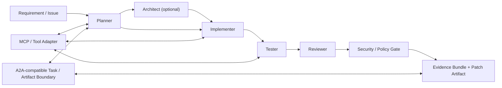

# A2A Agent 溝通：AI Coding 團隊的協作協議、框架與安全架構研究

- Report ID: `a2a-agent-communication-ai-coding-team-20260607-v1`
- Generated: `2026-06-07T09:30:00+08:00`
- Data cutoff: `2026-06-07`
- Sources: `45`
- Quality score: `96` / Structural score: `100`

## Executive Summary

- A2A 適合放在跨 runtime、跨 vendor、跨服務邊界的 agent-to-agent 任務協議；MCP 適合放在 agent-to-tool/context/resource 的能力存取層。兩者不是互斥替代品。
- AI Coding 團隊若只在同一個程式內運作，優先採用 OpenAI Agents SDK、LangGraph、Pydantic AI、CrewAI 等框架的 handoff、supervisor 或 graph 控制會更落地；A2A 應當作外部任務與 artifact boundary。
- 穩健系統的核心不是增加 agent 數量，而是建立可審計的 contract：需求引用、任務狀態、角色、輸入/輸出 artifact、測試證據、review 證據、trace ID、權限與 policy gate。
- 安全風險不只在工具，也在 agent skill、文件、code comments、tool description、protocol payload 與 shell execution。技能架構可以使用，但必須版本化、權限化與政策檢查。

## Key Findings

### C-001. A2A and MCP solve different communication layers: A2A is best treated as an external agent-to-agent task and artifact protocol, while MCP exposes tools, resources, prompts, and context to an agent runtime.

- Confidence: `high`
- Evidence: `S-001`, `S-003`, `S-004`, `S-006`, `S-018`, `S-022`, `S-023`
- Reasoning: The official specs expose different nouns and boundaries. A2A centers AgentCard, tasks, messages, parts, artifacts, and status updates; MCP centers host/client/server capability exposure.

### C-002. For an AI coding team, same-runtime orchestration should usually use framework handoffs or graph control, not A2A, unless agents are separated by vendor, runtime, permission boundary, or long-running service ownership.

- Confidence: `high`
- Evidence: `S-008`, `S-009`, `S-010`, `S-020`, `S-026`, `S-027`, `S-028`, `S-029`, `S-033`, `S-034`
- Reasoning: Frameworks provide lower-latency local state, typed handoff, tracing, and graph control. A2A becomes valuable when the communication boundary is broader than one framework runtime.

### C-003. The minimum robust coding-team contract is not free-form chat; it needs task state, role, requirement references, input artifacts, output artifacts, test evidence, review evidence, trace IDs, and policy/capability boundaries.

- Confidence: `high`
- Evidence: `S-006`, `S-009`, `S-010`, `S-024`, `S-025`, `S-028`, `S-040`, `S-041`, `S-042`, `S-043`
- Reasoning: Specs and benchmarks consistently show the need to preserve artifacts, state, traces, and reproducibility. Security sources add the need for permission and policy evidence.

### C-004. Multi-agent coding is worthwhile only when role separation, independent verification, long-context partitioning, parallel exploration, or cross-domain/tool isolation outweigh orchestration overhead.

- Confidence: `medium-high`
- Evidence: `S-020`, `S-026`, `S-029`, `S-030`, `S-031`, `S-033`, `S-034`, `S-035`, `S-037`, `S-039`
- Reasoning: Anthropic and framework docs emphasize simpler workflows first, while coding-team papers show benefits when roles and verification loops are explicit.

### C-005. A practical AI coding team should start with planner, implementer, tester, reviewer, and security/policy roles; product-manager and architect roles become useful when requirements are ambiguous or architecture-heavy.

- Confidence: `medium-high`
- Evidence: `S-009`, `S-020`, `S-026`, `S-031`, `S-035`, `S-036`, `S-037`, `S-038`, `S-039`
- Reasoning: The role sets from ChatDev, MetaGPT, and AgentCoder converge on planning, implementation, and verification, while modern frameworks provide the handoff mechanisms.

### C-006. Agent skills are a real architectural layer, but they widen the attack surface; they should be versioned, permission-scoped, tested, and policy-checked like tools.

- Confidence: `high`
- Evidence: `S-041`, `S-042`, `S-044`, `S-045`, `S-026`
- Reasoning: OWASP Agentic Skills Top 10 and recent coding-assistant attack papers identify skills, tool descriptions, and shell interactions as injection and capability-escalation vectors.

### C-007. Current benchmarks such as SWE-bench are necessary but insufficient for A2A coding-team communication; the report should add handoff correctness, artifact completeness, defect catch rate, security catch rate, recovery, cost, latency, and human-intervention metrics.

- Confidence: `high`
- Evidence: `S-024`, `S-025`, `S-035`, `S-037`, `S-039`, `S-044`, `S-045`
- Reasoning: SWE-bench evaluates final coding task success, while multi-agent architecture needs extra measurements for communication quality and defense-in-depth.

### C-008. Adjacent protocols should be classified by layer: A2A/ACP/ANP handle agent communication and discovery, MCP handles tool/context access, and AG-UI handles user-interface event streams.

- Confidence: `high`
- Evidence: `S-014`, `S-015`, `S-016`, `S-017`, `S-022`, `S-023`, `S-032`
- Reasoning: The protocol nouns, transport surfaces, and target participants differ enough that a single-protocol architecture would blur responsibilities.

### C-009. The best first PoC is a hybrid: one internal orchestration framework for the coding team, MCP for tools and repository context, an A2A-compatible task/artifact envelope at team boundaries, and a policy gate for risky actions.

- Confidence: `high`
- Evidence: `S-001`, `S-004`, `S-006`, `S-008`, `S-009`, `S-010`, `S-028`, `S-040`, `S-041`, `S-043`
- Reasoning: This combines the lowest-friction local orchestration with protocol-grade external boundaries and security controls.

### C-010. Security policy must be enforced before tool execution and before accepting cross-agent artifacts, because prompt injection can travel through documentation, code comments, tool descriptions, skills, and protocol payloads.

- Confidence: `high`
- Evidence: `S-040`, `S-041`, `S-042`, `S-044`, `S-045`
- Reasoning: OWASP and recent research sources converge on indirect prompt injection, tool poisoning, excessive agency, and shell-command abuse as high-priority risks.

## Recommended Architecture



The core rule: keep internal team orchestration inside a framework graph or handoff runtime; expose cross-runtime work as an A2A-compatible task and artifact contract; place MCP/tool access behind policy and trace boundaries.

## Minimal Communication Contract

```json
{
  "task_id": "TASK-001",
  "requirement_refs": [
    "REQ-001",
    "REQ-002"
  ],
  "role": "implementer",
  "input_artifacts": [
    {
      "type": "requirements",
      "path": "docs/spec.md",
      "hash": "sha256:..."
    }
  ],
  "output_artifacts": [
    {
      "type": "patch",
      "path": "changes.diff",
      "hash": "sha256:..."
    }
  ],
  "evidence": [
    {
      "type": "test",
      "command": "pytest",
      "result": "pass",
      "log_hash": "sha256:..."
    }
  ],
  "trace_id": "TRACE-001",
  "policy_decision": {
    "status": "allow",
    "rules": [
      "no-secret-write",
      "safe-shell"
    ]
  }
}
```

## Recommendations

### Implementability

**最小可落地 PoC：Framework handoff + MCP tools + A2A-compatible envelope + policy gate**

- Objective: 在一個 repo 任務中讓 planner、implementer、tester、reviewer/security 產生可追蹤 artifact 與證據。
- Technologies: OpenAI Agents SDK or LangGraph, MCP/tool adapter, A2A TaskEnvelope JSON, Conftest/OPA-style policy gate, trace log
- Minimum deliverable: 一個 CLI demo：輸入需求文件與 repo，輸出 task envelope、patch、test evidence、review evidence、policy decision、trace。
- Evidence: `S-006`, `S-009`, `S-010`, `S-028`, `S-040`, `S-041`, `S-043`

### If Only One Open-Source Tool Is Used

| Rank | Tool | Why | Main gap |
| --- | --- | --- | --- |
| 1 | LangGraph / LangChain multi-agent | 最適合需要 durable state、graph control、human-in-the-loop、supervisor/worker 與可觀測流程的 coding team。 | 需要自己設計 A2A boundary; 安全 policy 與 artifact schema 需額外實作 |
| 2 | OpenAI Agents SDK | handoffs、guardrails、tracing 與 platform guide 對最小 PoC 很直接，適合快速驗證 role handoff 與 evidence tracing。 | 跨 vendor/open-source runtime 邊界需要 adapter; 不是完整 A2A protocol implementation |
| 3 | CrewAI or Pydantic AI | CrewAI 適合 role/task crew 建模，Pydantic AI 適合輕量 typed Python agent；二者都適合快速驗證流程，但需補強 protocol/security layer。 | durable execution與跨 runtime protocol需另補; policy gate與benchmark harness需自建 |

### If Multiple Open-Source Tools Are Combined

| Rank | Stack | Why | Tradeoffs |
| --- | --- | --- | --- |
| 1 | LangGraph + MCP tools + A2A-compatible TaskEnvelope + OPA/Conftest gate | 兼顧 durable orchestration、工具邊界、外部協議邊界與安全治理，是本報告首選。 | 初始工程量較高; 需要定義內部 artifact schema |
| 2 | OpenAI Agents SDK + MCP + trace-first evidence store + security reviewer | 最容易快速落地，但長期跨 runtime interoperability 需補 A2A adapter。 | 生態綁定較高; A2A protocol coverage 需額外開發 |
| 3 | A2A boundary + AGNTCY/ACP comparison + framework-internal crew | 適合研究 protocol interoperability，但不建議作第一個工程落地版本。 | interop 不確定性最高; 需要更多 adapter; benchmark 設計複雜 |

### Future Directions

- **A2A coding-team benchmark extension**: 建立 SWE-bench plus communication metrics：handoff correctness、artifact completeness、defect/security catch rate、latency/cost、human intervention。 Trigger: 當 PoC 可以穩定跑 10 個以上 repo tasks 後開始。
- **Skill supply-chain and permission model**: 建立 skill manifest、permission scope、policy tests、hash pinning、review workflow。 Trigger: 當團隊開始複用自訂 agent skills 或 marketplace skills。
- **Protocol interoperability adapter**: 把內部 artifact contract 與外部 protocol adapter 分離，避免被某一個 protocol 變動拖住。 Trigger: 當需要跨 vendor/跨 team agent 溝通。

## Conflicts And Unknowns

- `R-F-001` (resolved): 採用 layered architecture：A2A for external agent task/artifact boundary, MCP for tool/context access, framework handoff for local orchestration.
- `R-F-002` (partially_resolved): 用角色分離與獨立驗證作為採用條件，並以 SWE-bench plus handoff/artifact/security metrics 測量是否真的有效。
- `R-F-003` (resolved): 技能與工具都納入同一個 allowlist、版本鎖定、權限 scope、policy decision、trace 和 human approval 流程。
- `R-U-001` (partially_resolved): 採用 SWE-bench 作為 final patch baseline，另加 handoff correctness、artifact completeness、defect/security catch rate、latency/cost、recovery 與 human intervention。
- `R-U-002` (open): 正式開發前重新跑 protocol source refresh；目前以 A2A 最新 docs、ACP/ANP/AG-UI source snapshot 作為 2026-06-07 判斷。
- `R-U-003` (open): 下一階段需要同一個 coding task 在 OpenAI Agents SDK、LangGraph、CrewAI/Pydantic AI 上跑最小 benchmark。

## Source Width

The report uses the following source groups:
- A2A core: 5
- Adjacent protocols: 5
- Benchmarks: 2
- Coding-team implementation: 2
- Coding-team research: 3
- Framework orchestration: 16
- Governance: 1
- MCP comparison: 3
- Observability: 1
- Protocol synthesis: 2
- Security: 5

For the full source list and summaries, see `sources/CATALOG.md`.

## Limitations

- 目前是文獻與文件研究，尚未實際跑 A2A server/client、MCP server、框架 runtime 的端到端 benchmark。
- 部分頁面是快速變動的官方文件或 repository default branch；正式採納前要重新 refresh。
- S-005、S-011、S-012 的價值較低或可能是過期/redirect 捕捉，已在 catalog 中標示，核心結論主要依賴較新的來源。

## Conclusion

最穩健的方向是 layered hybrid：同一個 AI Coding 團隊內用成熟 framework 做 handoff/graph/state/tracing，工具與 repo context 透過 MCP 或類 MCP tool boundary 管理，跨團隊或跨 runtime 用 A2A-compatible task/artifact envelope，所有 risky tool/skill/action 經過 policy gate 與 evidence validation。這比單純追求全 A2A 或全多-agent 更可實作，也更容易驗證。
